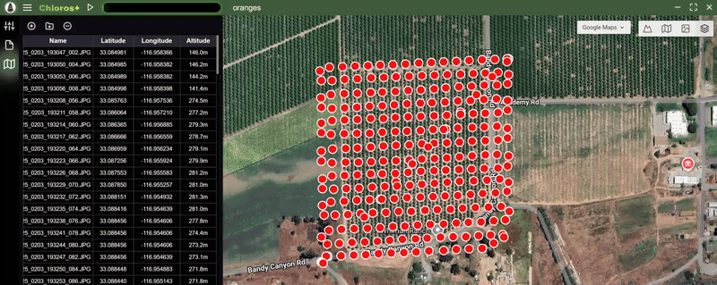

# Начало работы

<figure><figcaption></figcaption></figure>
Chloros — это программное приложение от [MAPIR](https://www.mapir.camera) для обработки изображений и других данных датчиков.

***

Chloros доступно в 3 режимах работы:

## Chloros: настольное приложение с графическим интерфейсом

Автономное отдельное окно со всеми функциями.

## [Chloros CLI: интерфейс командной строки](CLI.md)

Пакетная обработка командной строки. Идеально подходит для автоматизации, написания скриптов и сложных рабочих процессов. _CLI требует лицензии Chloros+ для доступа._

## [Chloros API: Python SDK](api-python-sdk.md)

Программный интерфейс Python для автоматизации и настраиваемых рабочих процессов. Идеально подходит для исследовательских конвейеров, интеграции с существующими приложениями Python и создания настраиваемых инструментов. _Для доступа к API требуется лицензия Chloros+._

***

## Chloros+

Хотя Chloros можно использовать бесплатно для большинства задач, вам может понадобиться больше. Именно в этом случае вам может пригодиться платная лицензия Chloros+. С лицензией Chloros+ вы можете разблокировать новые функции, такие как:

* **Многопоточная обработка**: значительно ускорьте обработку изображений для крупных проектов, одновременно обрабатывая изображения через конвейер.
* **Ускорение GPU (CUDA)**: используйте преимущества современных вариантов памяти GPU с более высокой емкостью, чтобы еще больше ускорить конвейер обработки изображений. Для достижения наилучших результатов мы рекомендуем 4 ГБ или более VRAM.
* **Chloros+**[**CLI**](CLI.md)**Доступ**: запускайте Chloros+ из командной строки для автоматизации и интеграции в ваше собственное программное обеспечение.
* **Chloros+**[**API**](api-python-sdk.md)**Доступ:** запустите Chloros+ из Python для программного управления, что обеспечит беспроблемную интеграцию с вашими исследовательскими процессами, рабочими потоками анализа данных и пользовательскими приложениями.
* **Использование нескольких устройств**: каждая лицензия Chloros+ позволяет зарегистрировать 2 и более устройств. Используйте свою учетную запись MAPIR Cloud для управления зарегистрированными устройствами. Добавьте поддержку дополнительных устройств, обновив свою лицензию Chloros+.
* **Усовершенствованный метод дебайеризации с учетом текстуры:** высококачественная дебайеризация с учетом краев в сочетании с моделью шумоподавления на основе искусственного интеллекта/машинного обучения, которая удаляет практически весь шум дебайеризации.
* **Пользовательские формулы мультиспектральных индексов:** введите пользовательские мультиспектральные индексы в растровые калькуляторы Chloros, как для обработки, так и для просмотра изображений в песочнице.

<a href="https://cloud.mapir.camera/pricing" class="button primary" data-icon="envira">Chloros+ Цены и регистрация</a>

<figure><figcaption></figcaption></figure>

<figure><figcaption></figcaption></figure>

<figure><figcaption></figcaption></figure>

<figure><figcaption></figcaption></figure>

<figure><figcaption></figcaption></figure>

<figure><figcaption></figcaption></figure>
